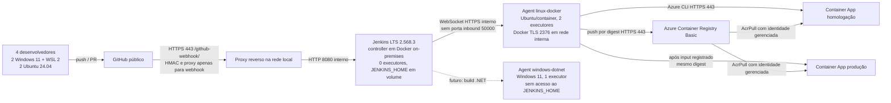

# E1 · Arquitetura Carparts

**Decisão.** O controller fica no ambiente local porque a diretoria exige Jenkins autogerenciado e dados do ERP on-premises. A porta 8080 está publicada somente em `127.0.0.1` no laboratório; em uso de equipe, o acesso à interface deve ocorrer por VPN/proxy HTTPS com autenticação. O endpoint de webhook precisa de proxy que exponha somente `/github-webhook/` e valide o segredo HMAC. O nó interno tem zero executores; builds ficam no agent Linux. O agent Windows fica reservado para um módulo .NET futuro e não é necessário para a API Node.js demonstrativa.

| Cenário | Vantagem | Risco e custo |
|---|---|---|
| Controller local em Docker (escolhido) | ERP e histórico permanecem locais; sem VM de Jenkins na nuvem; recriação por Dockerfile, plugins e JCasC | Exige backup do volume, atualizações e VPN/proxy seguros; eletricidade e operação locais não entram no teto Azure |
| Controller em VM Azure | Acesso e backup centralizados | Aumenta custo recorrente, exige túnel para ERP e eleva superfície de rede |
| Controller em AKS | Agents elásticos para muitos times | Complexidade e custo de cluster incompatíveis com quatro desenvolvedores e US$ 150/mês |

**Capacidade.** Um agent Linux com dois executores permite duas tarefas simultâneas. Para builds com Docker, aumentar paralelismo só após medir CPU/memória. Agent e daemon Docker compartilham uma rede Docker privada; a API do daemon usa TLS em 2376 e não é publicada no host. O segredo do agent fica fora do Git. O volume `jenkins-data` precisa de backup criptografado e retenção; a política do Jenkins descarta builds antigos.

**Evidência:** `compose.yaml`, `jenkins/controller/casc.yaml`, `evidence/live/` com logs e consulta da API de nós após execução. Fonte: [Jenkins Docker](https://www.jenkins.io/doc/book/installing/docker/), [JCasC](https://github.com/jenkinsci/configuration-as-code-plugin).

